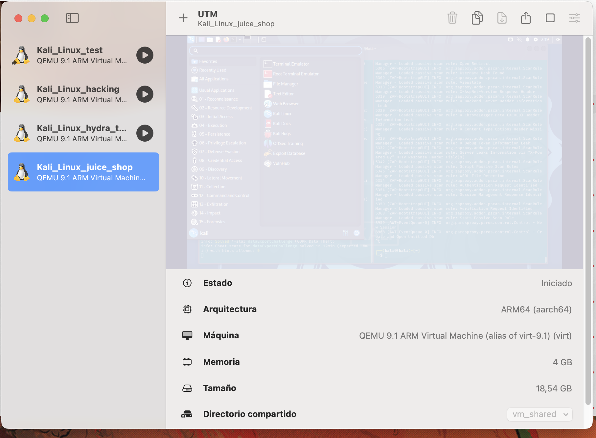
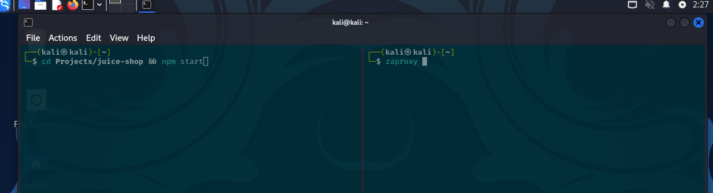
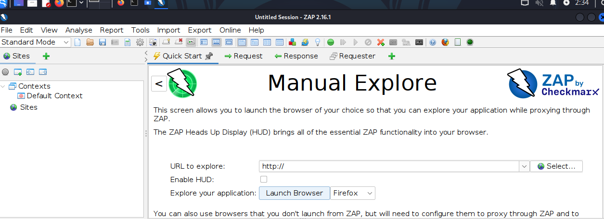
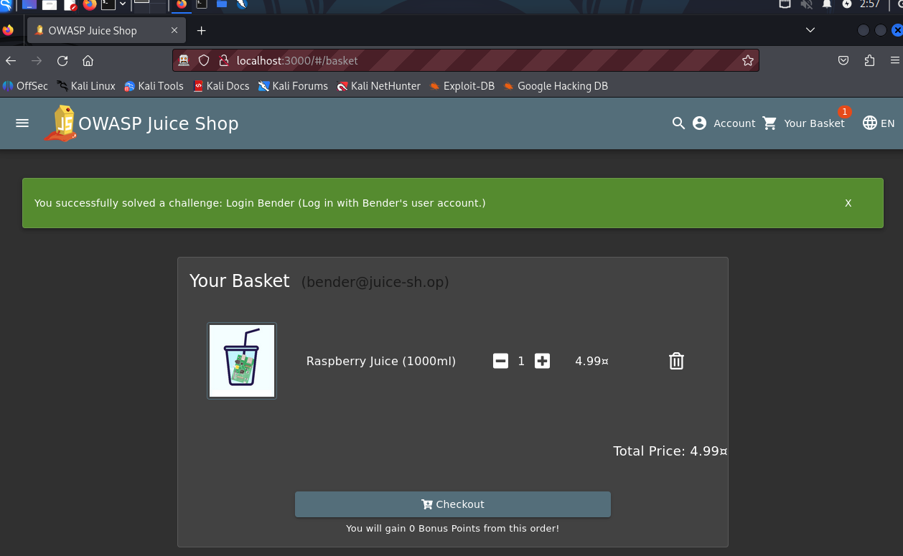
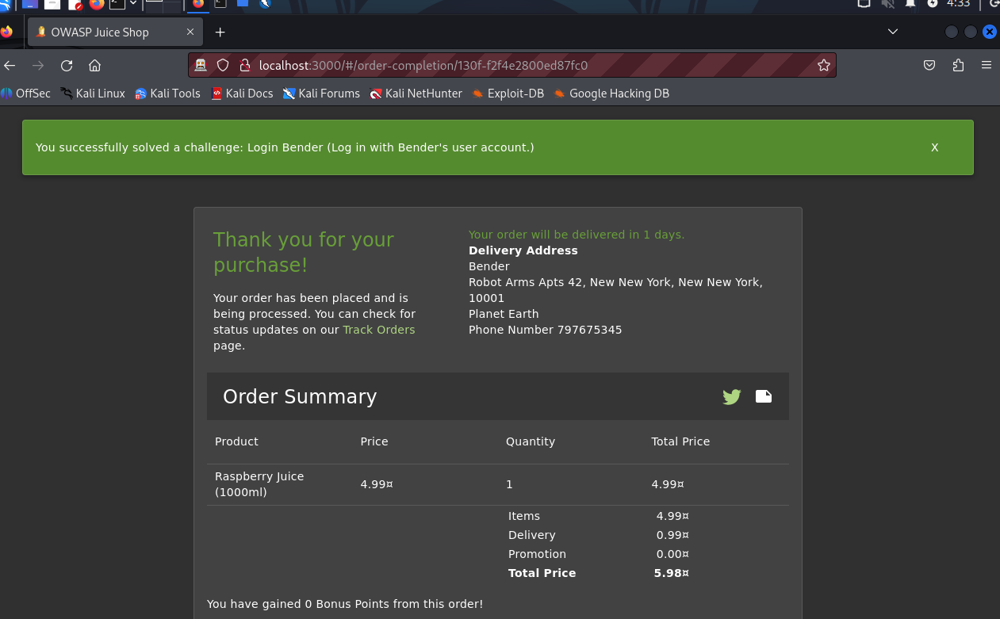
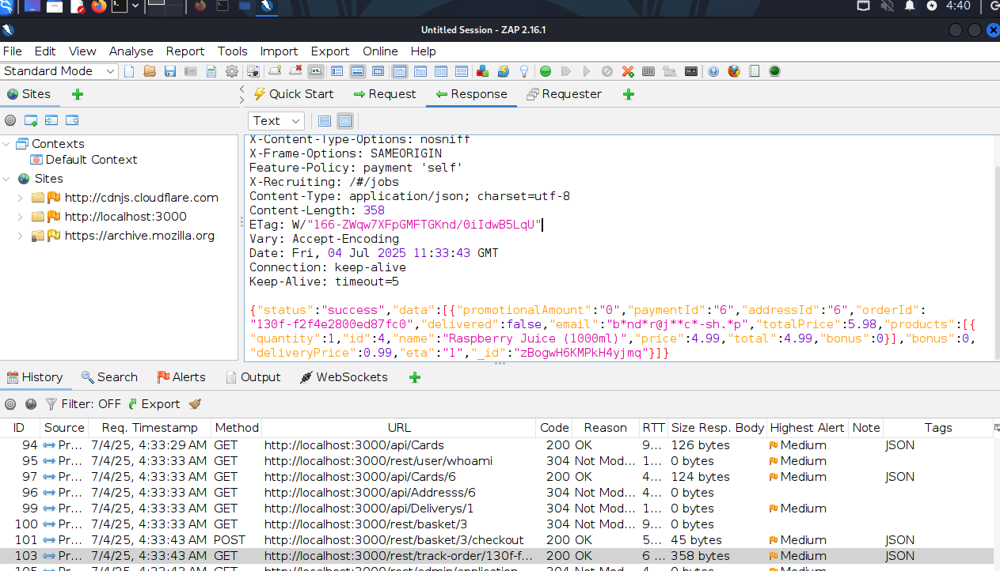
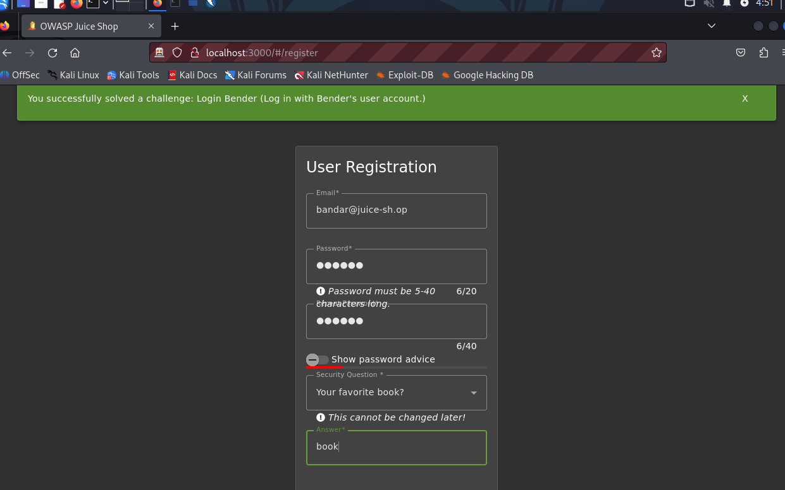
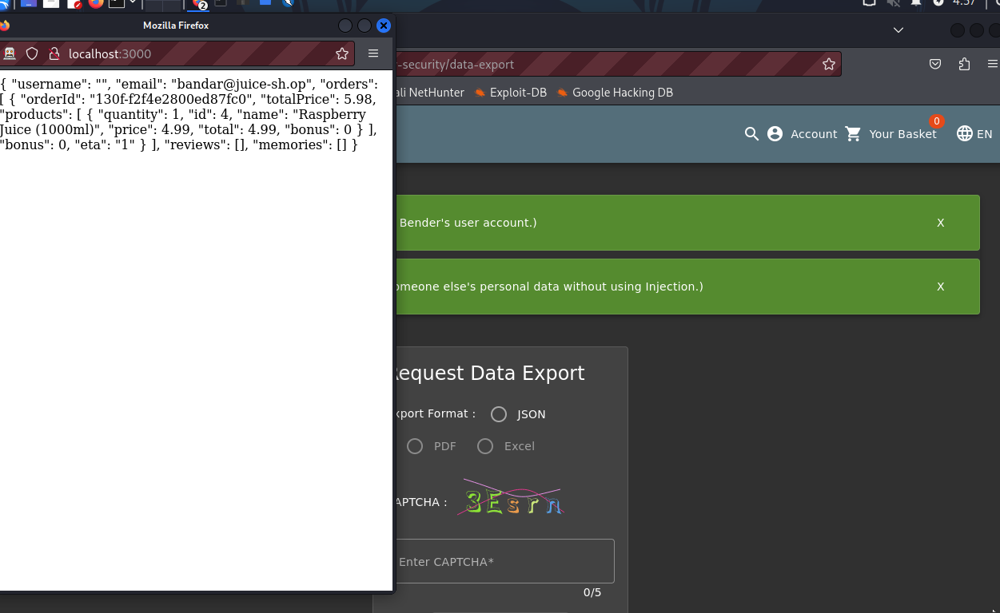
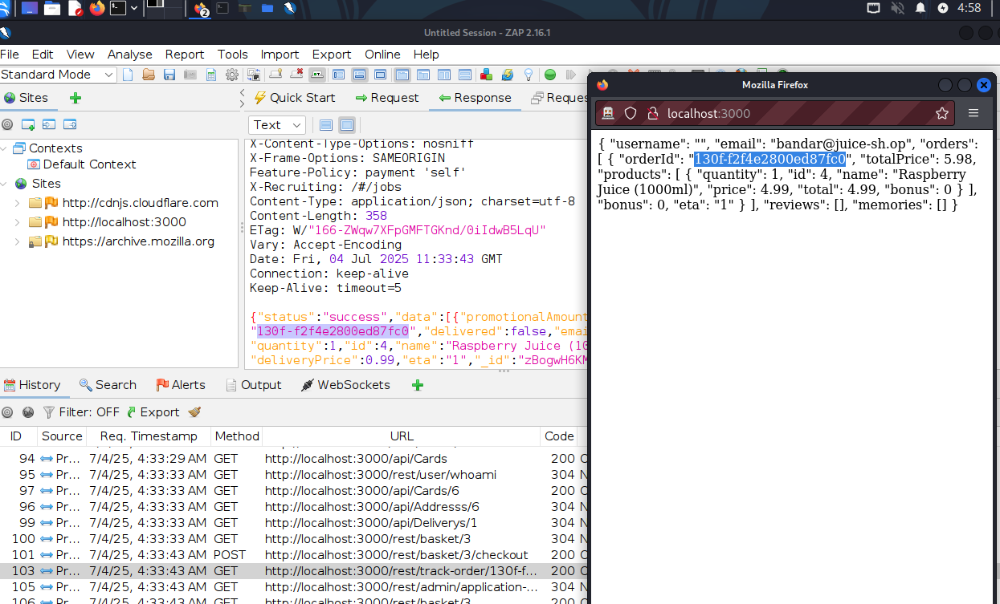

# GDPR Data Theft

For this challenge I started the Kali VM to launch the OWASP juice shop application.



With the VM active I started the owasp juice shop and the `zaproxy` tool. The `zaproxy` tool will be used as a penetration testing tool to find vulnerabilities in web applications.



Once the proxy tool started, I opened the browser from the `zaproxy` tool. In the new opened browser, I wrote in the search bar the url from the juice shop.

```
http://localhost:3000
```



Next I logged in as an existent user, in this case as `bender@juice-sh.op` (attack target) to make some product orders and inspect the petitions to the server.

I went to `http:localhost:3000/#/login` and in the email field I typed the following:

```
bender@juice-sh.op' OR email = 'bender@juice-sh.op' --
```

I did an injection here because the juice shop page is not protected against it and I don't know the password for `bender`.

After the login, I went to `http:localhost:3000/#/basket` and completed the purchase of the item that was already in the buying basket.





With the completed oder, I went back to `zaproxy` and inspected the complete order request. I could see a `GET` request `http:localhost:3000/rest/track-order/<oder_number>` with the following response payload:



The response shows the user `email` with the vowels sustitued with `*` before storing the order in the DB. The `orderId` is also available in the payload and can be used as a reference when retrieving the personal data with a new user.

Creating a new user `bandar@juice-sh.op` that only has different vowels than `bender` to cause a clash when obfuscating the email.

First thing to do is, loggin out as bender and the second, create a new user.



After having logged in with `bandar`, I visited `http:localhost:3000/#/privacy-security/data-export` and selected an export format (json).



The challenge was solved just after requesting the personal data.

I compared the previous `oderId` from `bender`, it is the `130f-f2f4e2800ed87fc0`. When we click export data, a popup will open with the data in a json format. There is the `130f-f2f4e2800ed87fc0` from the previous user purchase but using another user account that only happends to have different vowels as the attack target user. This weakness can be used to get more data from all the users in the juice shop (the users with purchase history).




