# Product tampering
To start with this challenge, I started the Kali VM to launch the OWASP juice shop application.

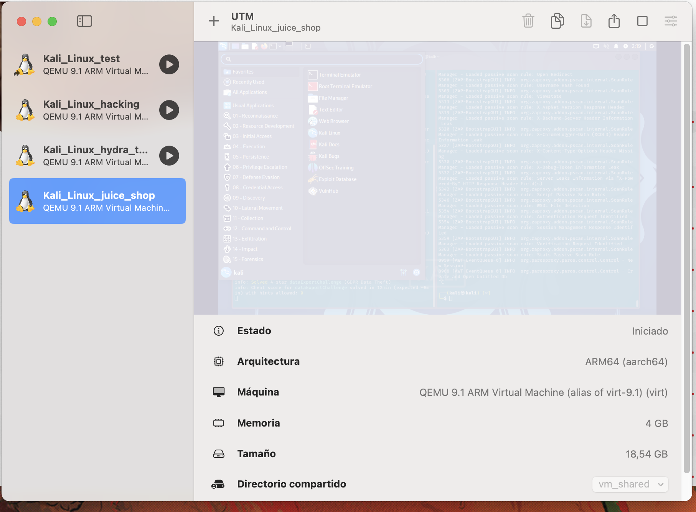

With the VM active I started the owasp juice shop and the `zaproxy` tool. The `zaproxy` tool will be used as a penetration testing tool to find vulnerabilities in web applications.


Once the proxy tool started, I opened the browser from the `zaproxy` tool. In the new opened browser, I wrote in the search bar the url from the juice shop.

```
http:localhost:3000
```

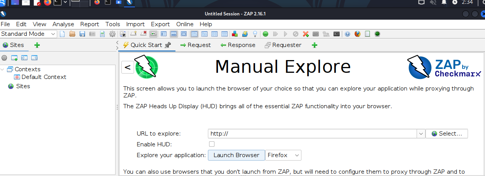

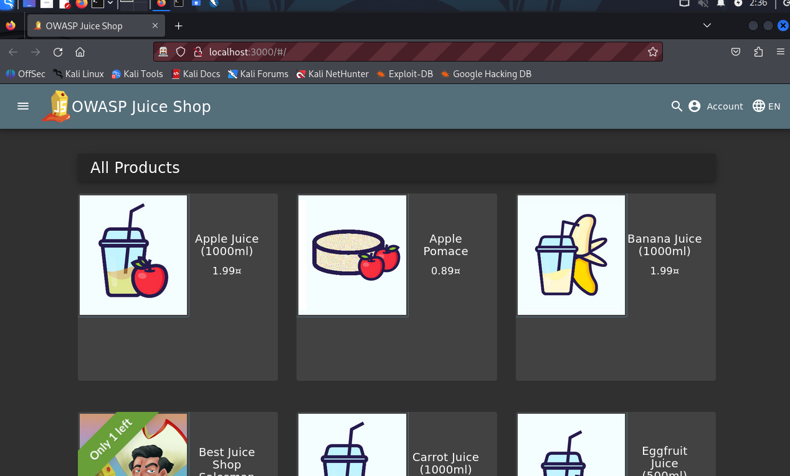

Once in the main page, I started to search for the target product (o-saft) and inspect the network to see how the requests look like.

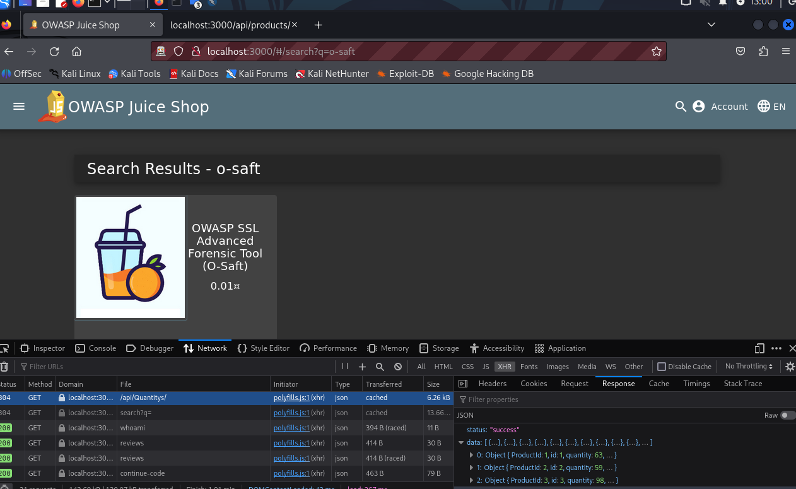

In the __Network__ tab, I can see a request `http://localhost:3000/api/Quantitys` with all the available products and also a `ProductId` but with no __description__ of the products.

I decided to modify the requesto to `http://localhost:3000/api/products` to see if I can get something from the server. I got a list with all the products, most important the `id` and `description`.

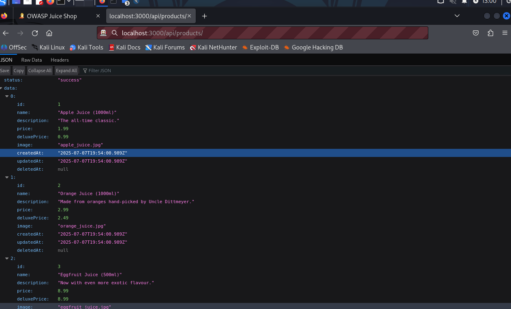

This gave me the `id` of the `o-saft` product, the `id` was `9`. The `description` contained the link that should be changed in this challenge. 

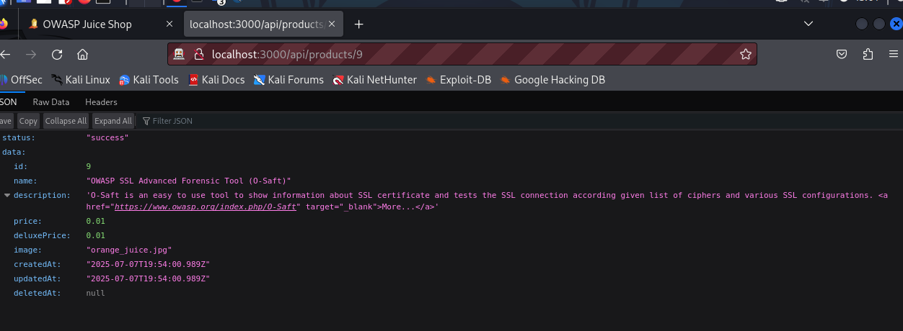

I had to find the correct path to make a request and change the `description` and pass `<a href=\"https://owasp.slack.com\" target=\"_blank\">More...</a>` in it. 

I noticed that when I logged in as `admin` and go to the `/administration` page, I can see the revious of all products. I could also __delete__ the reviews. So, I deleted a review and look at the network. 


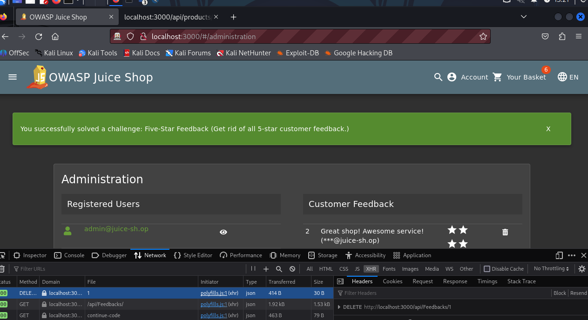

I saw a `DELETE` request to `http:localhost:3000/api/Feedbacks/1` and look at it in more detail with the `zaproxy` tool.

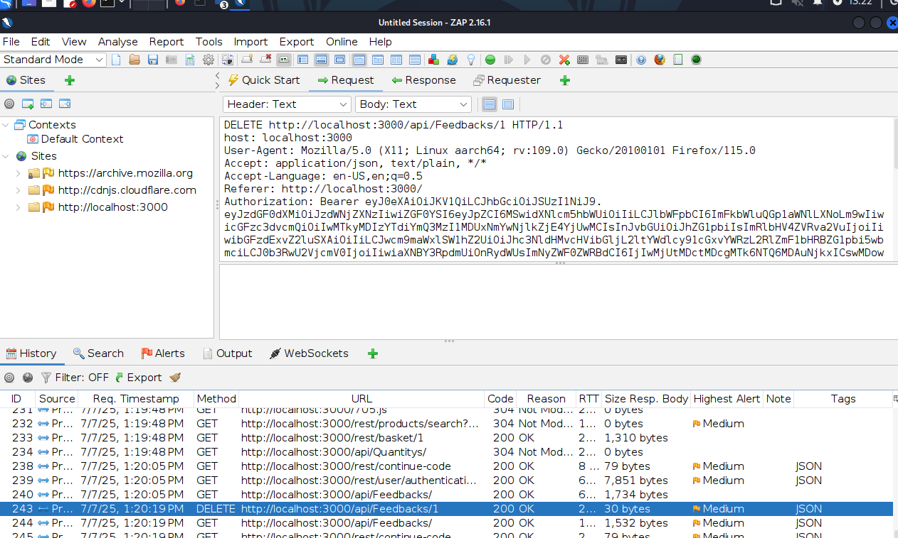

I copyed this request and changed to a `PUT http://localhost:3000/api/Products/9` and also added `Content-type: application/json` to the `header`.

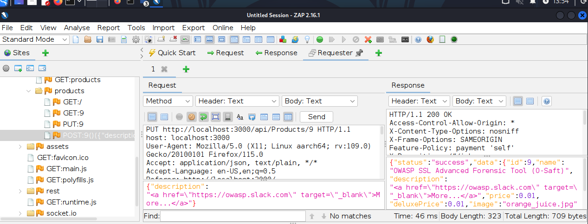

After sending the request, I look at the site `http://localhost:3000/api/products/` to see the changes:

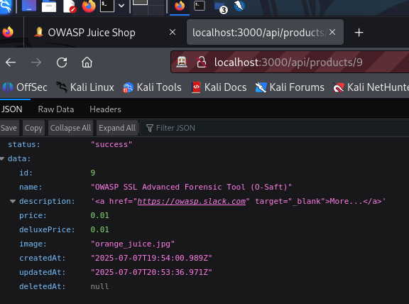

The product's description was updated with the desired link. I visit the product's page and saw the challenge solved element. 

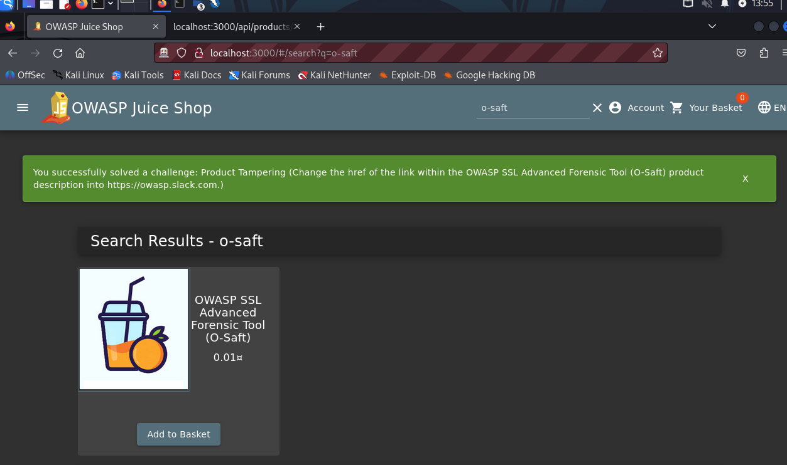

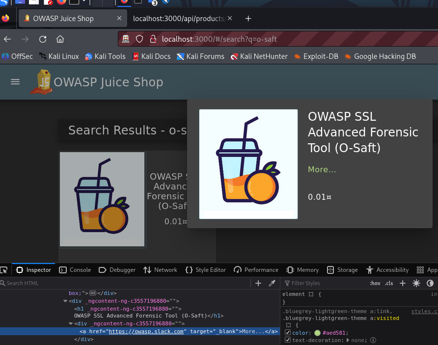

This was possible due to the API vulnerability to send the request with the `PUT` command.