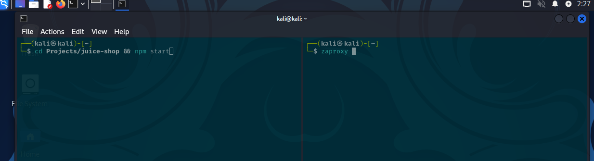

# Product Tampering

To start with this challenge, I started the Kali VM to launch the OWASP Juice Shop application.


With the VM active, I started the OWASP Juice Shop and the `ZAP` tool. The `ZAP` tool will be used as a penetration testing tool to find vulnerabilities in web applications.



Once the proxy tool started, I opened the browser from the `ZAP` tool. In the newly opened browser, I entered the URL from the Juice Shop in the search bar.

```
http://localhost:3000
```


Once on the main page, I started to search for the target product (O-Saft) and inspect the network to see how the requests look.


In the **Network** tab, I can see a request `http://localhost:3000/api/Quantitys` with all the available products and also a `ProductId`, but with no **description** of the products.

I decided to modify the request to `http://localhost:3000/api/products` to see if I can get something from the server. I got a list with all the products and, most importantly, the `id` and `description`.


This gave me the `id` of the `O-Saft` product, which is `id: 9`. The `description` contained the link that should be changed in this challenge.


I had to find the correct path to make a request and change the `description` to `<a href=\"https://owasp.slack.com\" target=\"_blank\">More...</a>`.

I noticed that when I log in as `admin` and go to the `/administration` page, I can see the reviews of all products. I can also **delete** the reviews. So, I deleted a review and took a look at the network.


I saw a `DELETE` request to `http://localhost:3000/api/Feedbacks/1` and looked at it in more detail with the `ZAP` tool.


I copied this request and changed it to a `PUT http://localhost:3000/api/Products/9` and also added `Content-Type: application/json` to the **header**.


After sending the request, I looked at the site `http://localhost:3000/api/products/` to see the changes:


The product's description was updated with the desired link. I visited the product's page and saw the challenge solved element.


This was possible due to the API vulnerability that allows sending requests with the `PUT` command. This kind of attack can lead to unauthorized access to external resources or the dissemination of misleading information.