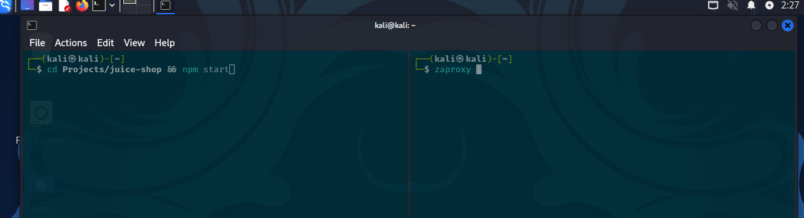
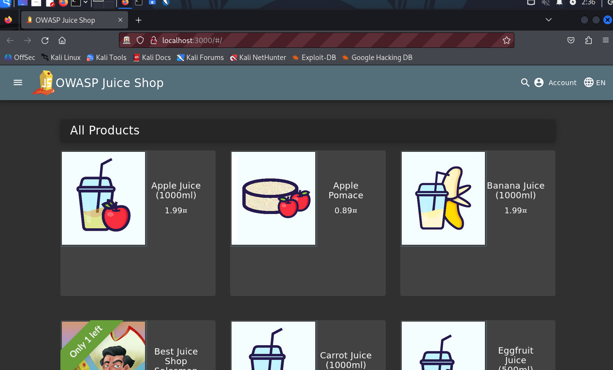
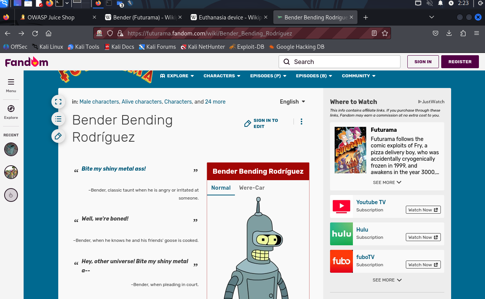
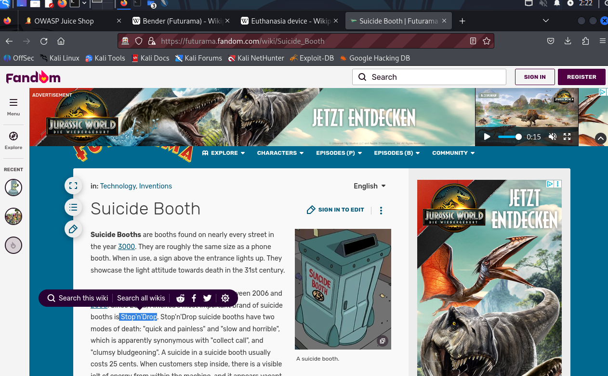

# Reset Bender's Password

To start with this challenge, I started the Kali VM to launch the OWASP Juice Shop application.


With the VM active, I started the OWASP Juice Shop and the `ZAP` tool. The `ZAP` tool will be used as a penetration testing tool to find vulnerabilities in web applications.



Once the proxy tool started, I opened the browser from the `ZAP` tool. In the newly opened browser, I entered the URL from the Juice Shop in the search bar.

```
http://localhost:3000
```




I went directly to the `forgot-password` page at `http://localhost:3000/#/forgot-password` to find out what Bender's **security question** is.


Bender's security question is **"Company you first worked as an adult?"**. The next step is to find the answer.

I know that Bender is a character from the TV show **Futurama**, and the OWASP Juice Shop gives a lot of hints about it.

That is why I searched for Bender in a **Fandom wiki**; this kind of wiki has all the information about fictional characters. I visited `https://futurama.fandom.com/wiki/Bender_Bending_Rodr%C3%ADguez` to search for the character's employment information.



After a while, I found out that one of Bender's first jobs was as a **"girder bender"** and those were used to build **"Suicide Booths"**. So, I tried giving **"girder bender"** and **"Suicide Booths"** as answers, but those weren't the correct answers.

The next thing I did was to read more about the **"Suicide Booths"**. I went to `https://futurama.fandom.com/wiki/Suicide_Booth`. On this site, I discovered that one of the most important brands that builds these booths is **"Stop'n'Drop"**.



I gave **"Stop'n'Drop"** as the answer for the security question, and I was able to reset Bender's password.


The consequences of this vulnerability could lead to gaining access to sensitive information, such as personal data and financial data.