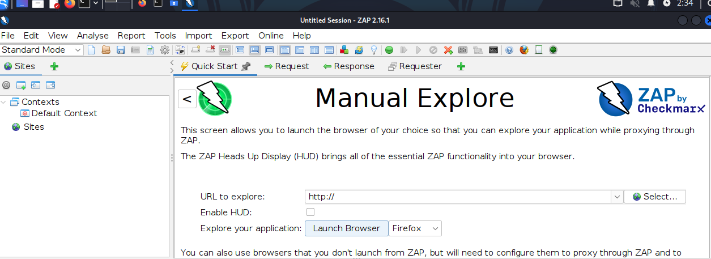
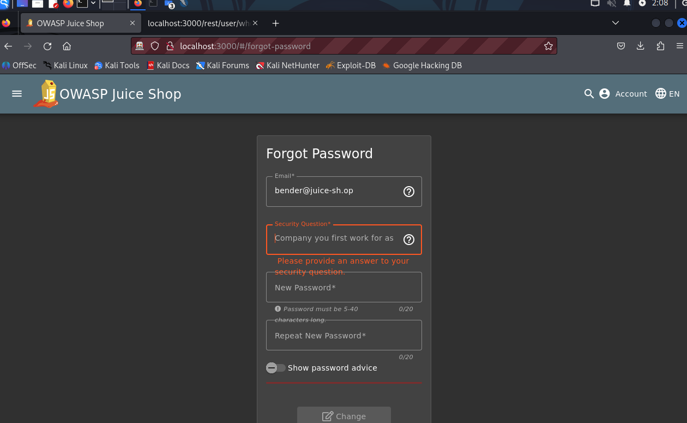

# Reset Bender's password.

To start with this challenge, I started the Kali VM to launch the OWASP juice shop application.


With the VM active I started the owasp juice shop and the `zaproxy` tool. The `zaproxy` tool will be used as a penetration testing tool to find vulnerabilities in web applications.


Once the proxy tool started, I opened the browser from the `zaproxy` tool. In the new opened browser, I wrote in the search bar the url from the juice shop.

```
http://localhost:3000
```




I went direct to the `forgot-password` page at `http://localhost:3000/#/forgot-password` to find out what is Bender's __security question__.



Benser's security question is __"Company you first work as an adult?"__. Next step is to find the answer.

I know that Bender is a character from the TV show __Futurama__ and the OWASP shop gives a lot of hints about it. 

That is why I searched for Berder in a `fandom wiki`, this kind of wikis have all the information about fictional charactes. I visited `https://futurama.fandom.com/wiki/Bender_Bending_Rodr%C3%ADguez` to search for the character's employment information. 


After a while, I found out that one of Bender's first job was as a __"girder bender"__ and those where used to build __"Suicide booths"__. So, I try giving __"girder bender"__ and __"Suicide booths"__ but that wasn't the correct answer.

The next thing I did was to read more about the __"Suicide booths"__, I went to `https://futurama.fandom.com/wiki/Suicide_Booth`. In this site I discovered that, one of the most important brands that build this booths is __"Stop'n'Drop"__.


I gave __"Stop'n'Drop"__ as an answer for the security question and I was able to reset Bender's password. 


That is how I solved the challnege.